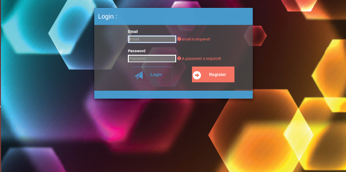
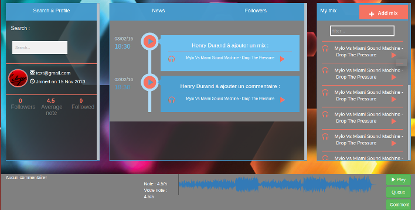
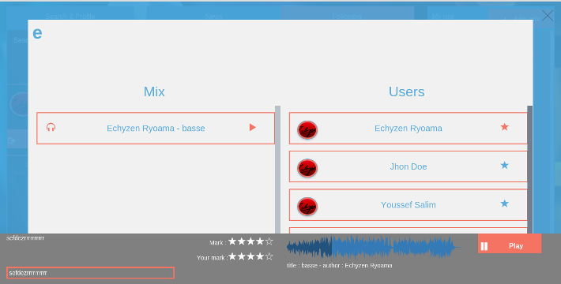
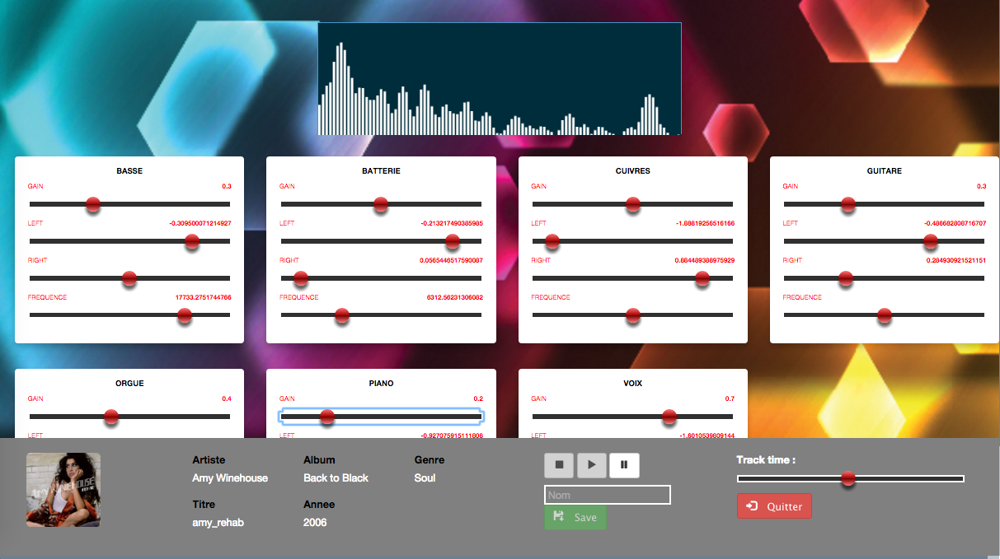
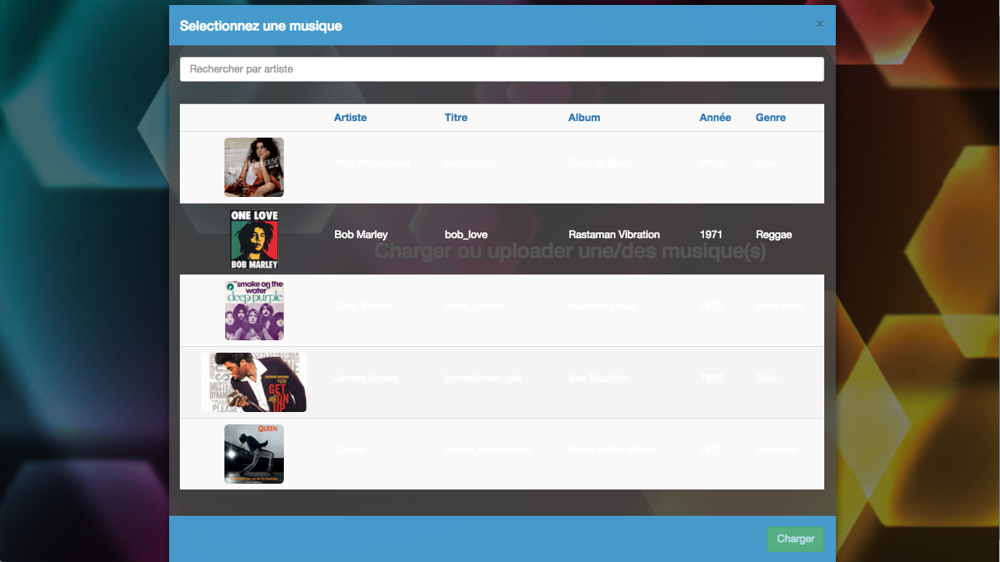

# Programmable web JS

### Membres

- Salah Bennour <bennour@polytech.unice.fr>
- Guillaume Borg <guillaume.unice@gmail.com>
- Youssef Salim <salim@polytech.unice.fr>
- Yuqi Wang <wang@polytech.unice.fr>

## Features

### Backend
* Authentification (Interceptor + JsonWebToken + middleware).
* Social aspect : Comment & mark a mix and follow an user.
* Search a specific mix or user.
* Loading Mix in Wav and listen it thank to a player in bottom of the web page.
* Upload some track in order to mix them.
* Apply some sound effect in our mix (gain, stereo, etc...).

### Frontend
* Include ngWaveSurfer an angular module base on Web Audio API to play music.
* Use Web Audio API to make some sound effects.
* A custom morph search.
* A vertical timeline.


## Installation

#### Requirements
To run the application, you'll need: <br />
* NodeJS with NPM installed
* Grunt
* ExpressJs
* Sass (ruby (or ruby dev) and gem installed and run the following command "gem install compass")
* To have Mongo Database


First of all, create a mongoDB database call "test".
Then, import in your Mongo Database : /backend/dump_database/users.json and /backend/dump_database/songs.json for this make the following command in :<br />
/backend/dump_database

```
mongoimport -d prod -c songs songs.json
mongoimport -d prod -c users users.json
```

#### Downloading the Dependencies
After cloning the source code from Git, you need to run the following command to download all the dependencies (express, mocha, etc.) in :<br />
/backend<br />
/frontend

```
npm install
```

Then, install frontend package. So run the following command to download all frontend dependencies in :<br />
/frontend

```
bower install
```


#### Running the Server
After downloading all the dependencies, you can run the server with the following command in /backend:

```
NODE_ENV=production npm start
```

The server's api will then be accessible at `http://localhost:3000`.


#### Running the test Server
After downloading all the dependencies, you can run the server in test "env" with the following command in /backend:
```
NODE_ENV=development npm start
```
And then run the test in an other terminal with the following command in /backend :
```
npm test
```

#### Running frontend App
After downloading all the dependencies, you can run the following command in :<br />
/frontend

```
grunt serve
```

Each frontend Application will be accessible at `http://localhost:9000`.

#### Connect frontend App with an existing user
login : test@gmail.com<br />
password : azerty<br />

## Some UI

### Login page


### Home page


### Search page


### Mix table


### Upload tracks


### Songs selection


## Video Presentation

[Avaiable here!](https://www.youtube.com/watch?v=N36MCbnS43c)

## Contact

Feel free to contact us :

* [Salah Bennour](mailto:bennour@polytech.unice.fr)
* [Guillaume Unice](mailto:guillaume.unice@gmail.com)
* [Youssef Salim](mailto:salim@polytech.unice.fr)
* [Yuqi Wang](mailto:wang@polytech.unice.fr)

---

